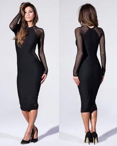
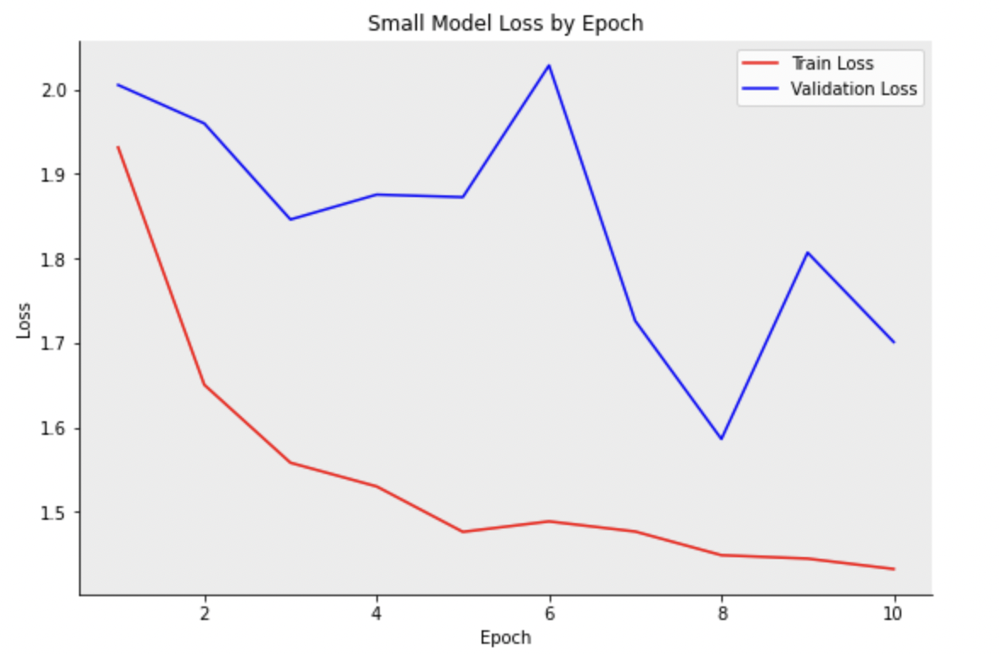
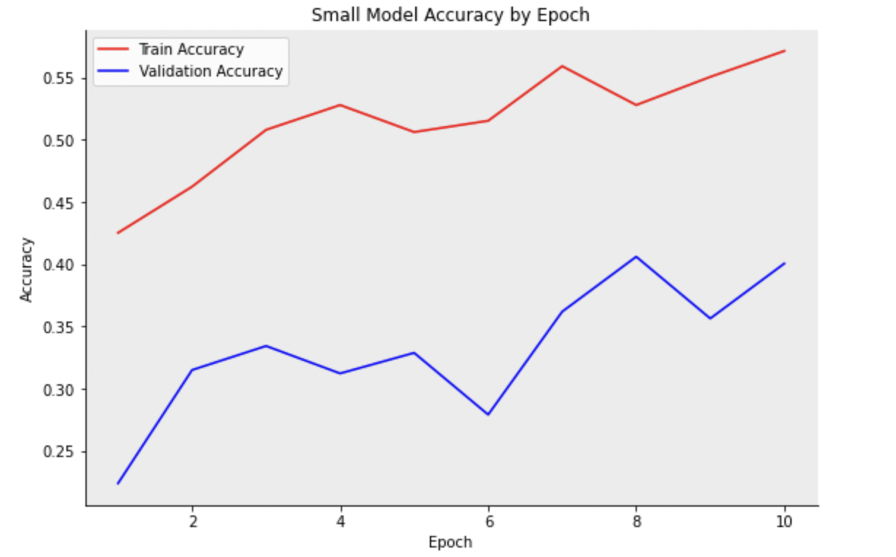

# Predicting Clothing Category using CNNs
> By: Cameron Meziere, Seungju Han

## Objective
Classify the type of clothings from images.

## Data
* About 290K clothing images(6GB) with 46 unique category labels
* Labels: Anorak, Blazer, Blouse, Bomber, Button-Down, etc (46 unique labels)
* Source: [DeepFashion](http://mmlab.ie.cuhk.edu.hk/projects/DeepFashion/AttributePrediction.html)

  
  
"Dress"

## Modeling
* Technique: Fine tuning pre-trained model
* Architecture: ResNet18 Convolutional Neural Network
* [Training on full dataset](https://github.com/seungjoohan/Fashion_Prediction/blob/main/resnet18_v1.ipynb)
* [Training on partial dataset](link to notebook)

## Results

##### Loss and Accuracy Graphs on Small Dataset

  

  

* [ResNet18 on Full Dataset Accuracy](https://github.com/seungjoohan/Fashion_Prediction/blob/main/resnet18_v1_acc.ipynb)
